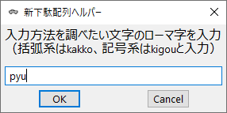
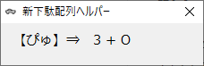

# 新下駄配列ヘルパー

## 概要

もともとは拙作「AutoHotKeyによる新下駄配列実装」からヘルパー機能だけを取り出したものでしたが、
新下駄配列ヘルパーにしかない機能を盛り込んでバージョンアップしました。

## インストール

Releaseから入手したzipを任意のフォルダに解凍します。

### exeファイルを使う場合

ShinGetaHelper.exeをダブルクリックして実行します。

### AutoHotKeyスクリプトを使う場合

ShinGetaHelper.ahkをAutoHotKeyで実行します。


## 設定

起動時に同じフォルダにあるShinGetaHelper.iniを読み込みます。
設定を変更するにはこのファイルをエディタで編集してください。

■ShinGetaHelper.iniの設定項目
```
[Main]
HKey=+^h
EnableLog=1
```

|キー|値|
|---|----|
|HKey|新下駄配列ヘルパーを呼び出すホットキー。上記設定例はShift+Ctrl+h※|
|EnableLog|ヘルプ提示時にログを記録するか。0：記録しない、1：記録する|

※Shift：+　、　Ctrl：^　、　Alt：!

## 使い方

### 基本的な使い方

ある文字の入力方法がわからなくなったとき、上記設定で定義したホットキー（デフォルトは`Ctrl + Shift + h`）を入力すると、下図のようなダイアログがでます。



ここに新下駄配列の入力方法を知りたい文字のローマ字を入力すると、入力方法を表示します。



この画面は、エンターキー、スペースキー、ESCキーのいずれかを押すと閉じます。

あるいは、この画面を閉じずにさらにホットキーを入力してローマ字を繰り返し入力すると、下図のように全ての結果をまとめて表示することができます。


### ログ機能

設定ファイルで`EnableLog=1`としておくと、新下駄配列のヘルプを表示した際に`HelperLog.csv`というファイルに以下のようなログを出力します。


これをExcelなどに読み込んで集計すれば、自分の苦手な文字がすぐに分かるので、時間のあるときに集中的に練習するということができます。

【Excelによる集計例】

